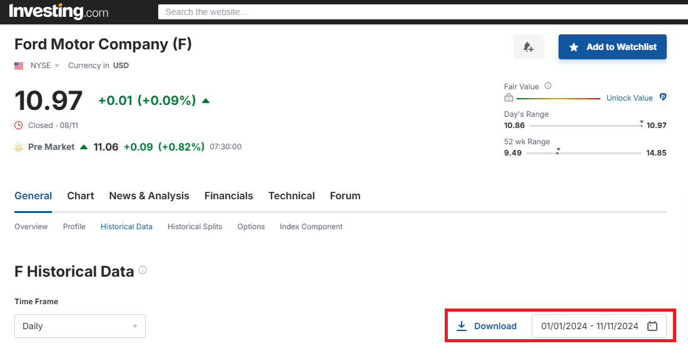
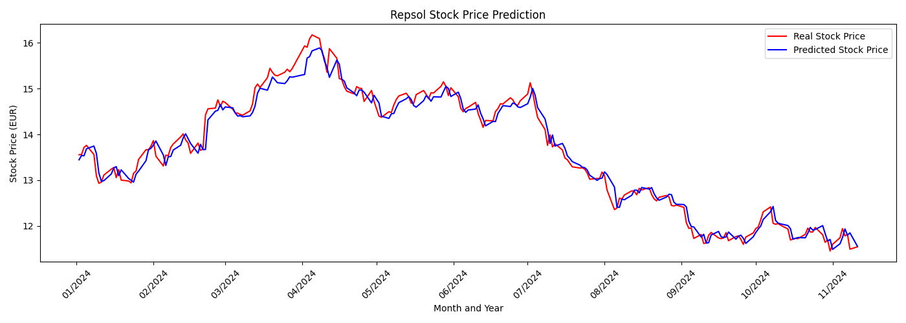

# Stock Market Trend Prediction with Recurrent LSTM Neural Networks


---

## Table of Contents

- [Introduction](#introduction)
- [Features](#features)
- [Project Structure](#project-structure)
- [Data](#data)
- [Installation](#installation)
- [Usage](#usage)
  - [Training a Model](#training-a-model)
  - [Making Predictions with a Pre-trained Model](#making-predictions-with-a-pre-trained-model)
- [Results](#results)
  - [Training Results](#training-results)
  - [Generated Graphs](#generated-graphs)
- [License](#license)

---

## Introduction

This project uses Long Short-Term Memory (LSTM) recurrent neural networks to predict stock prices for various companies. The model is designed with modularity and flexibility in mind, allowing for company-specific training and evaluation. It incorporates multiple features, such as the opening, closing, high, and low prices, trading volume, and percentage change, to capture temporal dependencies and patterns in historical stock data that could aid in forecasting future prices. 

The models are trained solely on the historical data of each company. For example, in this project, historical data from 2008 to 2023 was used to train models, and then the model’s predictions for 2024 were compared with actual prices. 

Of course, stock market prices are influenced by numerous factors, including geopolitical events, technological advancements, economic crises, and more. Despite these complexities and limitations, the model shows promising results. 

To replicate this model with other companies, you’ll need to download historical data from [investing.com](https://www.investing.com), as the code is specifically designed to work with the CSV format provided by that source. The model can handle CSV files in both English (“en”) and Spanish (“es”).

---

## Features

- **Modular Design**: Easily extended and customized for different companies and datasets.
- **Data Preprocessing**: Supports English and Spanish formats, with date parsing and number formatting.
- **Model Training**: Implements *Early Stopping* and model checkpointing to avoid overfitting.
- **Visualization**: Generates prediction and error graphs for performance analysis.
- **Prediction Script**: Enables predictions using pre-trained models without re-training.

---

## Project Structure 

In this repository, the `data` folder is empty. You’ll need to download historical stock data for each company from [investing.com](https://www.investing.com) to populate it.




```
Predicting Stock Market Trends with LSTM Recurrent Neural Networks/
├── assets/
├── data/
│   ├── Sony_train.csv
│   ├── Sony_test.csv
│   ├── Amazon_train.csv
│   ├── Amazon_test.csv
│   ├── Apple_train.csv
│   ├── Apple_test.csv
│   ├── Ford_train.csv
│   ├── Ford_test.csv
│   ├── Santander_train.csv
│   ├── Santander_test.csv
│   ├── Repsol_train.csv
│   └── Repsol_test.csv
├── models/
│   └── [Trained models will be saved here]
├── outputs/
│   └── [Generated graphs will be saved here]
├── src/
│   ├── data_processing.py
│   ├── model.py
│   ├── visualization.py
│   ├── main.py
│   └── predict.py
├── requirements.txt
├── LICENSE
└── README.md
```

---

## Data

The project uses historical stock data in CSV format. The data should include the following columns (in English or Spanish):

- Date
- Price (Closing price)
- Open
- High
- Low
- Volume
- Change % (Percentage change)

---

## Installation

1. **Clone the repository**:

   ```bash
   git clone https://github.com/moises60/Predicting_Stock_Market_Trends_with_LSTM_Recurrent_Neural_Networks.git
   ```

2. **Navigate to the project directory**:

   ```bash
   cd Predicting_Stock_Market_Trends_with_LSTM_Recurrent_Neural_Networks
   ```

---

## Usage

### Training a Model

Run the `main.py` script with the necessary arguments:

```bash
python src/main.py --company "CompanyName" --train_csv "data/company_train.csv" --test_csv "data/company_test.csv" --language "en" --timesteps 90 --epochs 200
```

- `--company`: Name of the company.
- `--train_csv`: Path to the training CSV file.
- `--test_csv`: Path to the test CSV file.
- `--language`: Language of the data (`en` or `es`).
- `--timesteps`: Number of timesteps for the sequence (default is 90).
- `--epochs`: Number of training epochs (default is 200).
- `--batch_size`: Batch size for training (default is 32).

**Example**:

```bash
python src/main.py --company "Sony" --train_csv "data/Sony_train.csv" --test_csv "data/Sony_test.csv" --language "en" --timesteps 90 --epochs 200
```

### Making Predictions with a Pre-trained Model

Use the `predict.py` script to make predictions with a saved model:

```bash
python src/predict.py --company "CompanyName" --test_csv "data/company_test.csv" --model "models/CompanyName_best_model.keras" --language "en"
```

- `--model`: Path to the pre-trained model file.

**Example**:

```bash
python src/predict.py --company "Sony" --test_csv "data/Sony_test.csv" --model "models/Sony_best_model.keras" --language "en"
```

---

## Results

### Training Results

Below are the results obtained after training the model for different companies. The performance metrics used are MAE (Mean Absolute Error) and RMSE (Root Mean Square Error).

1. **Sony**

   ```
   MAE: 0.2351
   RMSE: 0.3265
   ```
   The model predicts Sony stock prices with an average error of approximately $0.2351 and an RMSE of $0.3265, indicating good accuracy within this price range.

   ```bash
   python src/main.py --company "Sony" --train_csv "data/Sony_train.csv" --test_csv "data/Sony_test.csv" --language "en"
   ```

2. **Amazon**

   ```
   MAE: 9.2710
   RMSE: 10.8094
   ```
   Given Amazon’s high stock price, a MAE of around $9.27 represents a small percentage of the overall price, indicating acceptable model accuracy.

   ```bash
   python src/main.py --company "Amazon" --train_csv "data/Amazon_train.csv" --test_csv "data/Amazon_test.csv" --language "en"
   ```

3. **Apple**

   ```
   MAE: 15.7278
   RMSE: 20.0409
   ```
   The average error is higher compared to other companies. Larger technology companies can show more variability due to many influencing factors, making stock prediction more challenging.

   ```bash
   python src/main.py --company "Apple" --train_csv "data/Apple_train.csv" --test_csv "data/Apple_test.csv" --language "en"
   ```

4. **Ford**

   ```
   MAE: 0.1827
   RMSE: 0.2883
   ```
   The model achieves high accuracy when predicting Ford stock prices.

   ```bash
   python src/main.py --company "Ford" --train_csv "data/Ford_train.csv" --test_csv "data/Ford_test.csv" --language "en"
   ```

5. **Santander**

   ```
   MAE: 0.0585
   RMSE: 0.0763
   ```
   The model shows excellent accuracy for Banco Santander stock predictions, with very low errors.

   ```bash
   python src/main.py --company "Santander" --train_csv "data/Santander_train.csv" --test_csv "data/Santander_test.csv" --language "es"
   ```

6. **Repsol**

   ```
   MAE: 0.1373
   RMSE: 0.1804
   ```
   The results indicate good accuracy in predicting Repsol stock prices.

   ```bash
   python src/main.py --company "Repsol" --train_csv "data/Repsol_train.csv" --test_csv "data/Repsol_test.csv" --language "es"
   ```

### Generated Graphs

After training the model and making predictions, graphs are generated to help visualize model performance.

#### Prediction Graph




---

## License

This project is licensed under the MIT License. See the [LICENSE](LICENSE) file for more details.
